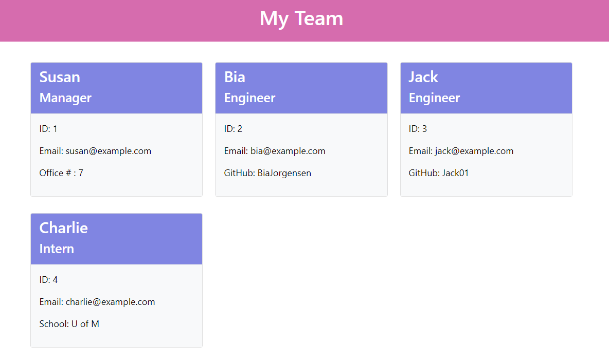

# Team Profile Generator 

## Description
Team Profile Generator project is a command line (CLI) application that allows users to easily create an HTML file that displays the user's team's basic information by answering a few questions on the CLI. The user can add one manager, and multiple engineers and interns; all three roles will have information about their name, ID and email; manager will have office number information, engineer will have GitHub username, intern will have information about their school name\
This project is part of a challenge from Full Stack Coding Bootcamp at the University of Minnesota.

## Installation

For this application, please use https://nodejs.org/en/ to install Node.js (version 16 is recommended).

## Usage
To create an HTML file with a Team Profile using this app, user needs to do the following:
1. Clone this project's repository to local machine by using SSH Key `git@github.com:BiaJorgensen/team-profile-generator.git`
1. In the CLI, navigate to index.js (./Develop/index.js) and type `node index.js` to run the app.
1. A series of questions will show up (one at a time).
1. After all questions are answered, the HTML file will be created and added to the "dist" folder.
1. Open the HTML in the browser to see the page.
1. Click on the team member's email to easily open the default email program (the email address will be populated on the "TO" field).
1. Click on the engineer's GitHub username to access their GitHub profile page.

## Tests

To run the tests in the tests folder, in the CLI, type `npm run test`. All tests should pass.

## Credits

N/A

## License

The license for this project is **The MIT License** 
To learn more about this license, please access https://opensource.org/licenses/MIT

## Walkthrough Video
[Link to the walkthrough video](https://drive.google.com/file/d/1Ff9WOOpJNTaCvdVCMwhfihOxBnlRIBji/view)  
<kbd></kbd>